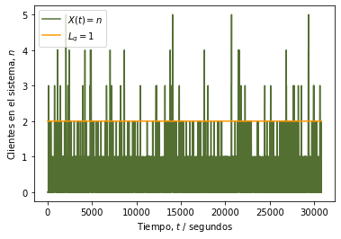

---
### Universidad de Costa Rica
#### IE0405 - Modelos Probabilísticos de Señales y Sistemas
#### Jordileth Bonilla Segura 
#### B41083, Grupo 02
---

# `L5` - *Cadenas de Markov*

> El caso especial de los procesos aleatorios donde existen "estados" y "transiciones" entre estos estados, las cadenas de Markov modelan las probabilidades 
de transición y el tiempo de permanencia entre cada estado. En particular, la teoría de colas describe la evolución del número de elementos en la fila, dado un 
flujo de entrada y un flujo de salida.

---

## Sistemas M/M/1

### Problema de ejemplo: un servidor web

> Un servidor web es modelado como un sistema M/M/1 con una tasa de arribo de 2 solicitudes por minuto. Es deseado tener 1 o más solicitudes en fila el 90\% del tiempo. 
¿Qué tan rápido debe ser el servicio? \nu es solicitudes atendidas por minuto.

El estado $i$ es el número de clientes en el sistema. La longitud de la fila es $L_q = i - 1$ (*queue length*), en virtud de la solicitud que está siendo 
atendida en $s = 1$ servidores. Es posible encontrar que:

$$
P( \text{1 o más clientes en el sistema} ) = \sum_{i=1}^{\infty} (1 - \rho) \rho^i  = 1 - \sum_{i=0}^{1} (1 - \rho) \rho^i = \rho
$$

que depende de $\rho = \lambda/\nu$ y del parámetro de servicio $\nu$ buscado. 

De los datos del problema: $\lambda = 2$. Para tener al menos una persona el 90\% del tiempo se necesita:

$$
\begin{aligned}
P( \text{1 o más clientes en el sistema} ) = \rho & = \left( \frac{\lambda}{\nu} \right) \leq 0.1 \\
\nu & \geq \frac{\lambda}{0.1} = \frac{2}{0.1} = 20 \quad \Rightarrow \quad \nu \geq 20
\end{aligned}
$$

es decir, el servidor debe atender más de 20 solicitudes por minuto en promedio para poder satisfacer el requisito.

**Nota**: Observar el cambio de unidades de minutos a segundos, para lograr mayor "granularidad".

En la figura siguiente se puede apreciar que para los valores mostrados a continuación, se obtiene una gráfica de los clientes que hay en el sistema, al pasar el tiempo.  

Parámetro lambda = 2.0

Parámetro nu = 6.0

Tiempo con más de 1 solicitudes en fila:
	 93.36%
   
Sí cumple con la especificación.
   
Simulación es equivalente a 8.35 horas.

 

