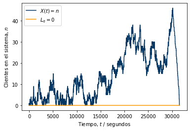
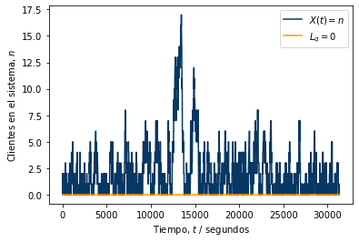

---
### Universidad de Costa Rica
#### IE0405 - Modelos Probabilísticos de Señales y Sistemas
#### Jordileth Bonilla Segura 
#### B41083, Grupo 02
---

# `L5` - *Cadenas de Markov*

> El caso especial de los procesos aleatorios donde existen "estados" y "transiciones" entre estos estados, las cadenas de Markov modelan las probabilidades 
de transición y el tiempo de permanencia entre cada estado. En particular, la teoría de colas describe la evolución del número de elementos en la fila, dado un 
flujo de entrada y un flujo de salida.

---

## Sistemas M/M/1

### Problema de ejemplo: un servidor web

> Un servidor web es modelado como un sistema M/M/1 con una tasa de arribo de 2 solicitudes por minuto. Es deseado tener 1 o más solicitudes en fila el 90% del tiempo. 
¿Qué tan rápido debe ser el servicio?  

De los datos del problema se encontró que se debe atender menos de 2,108 solicitudes por minuto en promedio para poder satisfacer el requisito.

**Nota**: Observar el cambio de unidades de minutos a segundos, para lograr mayor "granularidad". 

Se realizaron cambios al código base, para procurar que se tomara en cuenta el tiempo que debe haber solicitudes y que se contara el nuevo valor para las solicitudes atendidas por minuto, de modo que correspondiera con el gráfico de salida y la condición para que se cumpla la especificación. 

En la figura siguiente se puede apreciar que para los valores mostrados a continuación, se obtiene una gráfica de los clientes que hay en el sistema, al pasar el tiempo.  

Parámetro lambda = 2,0

Parámetro nu = 2,11

Tiempo con más de 0 solicitudes en fila:
	 92,02%
   
Sí cumple con la especificación.
   
Simulación es equivalente a 8,64 horas.

 

Por el contrario, para un caso en el que se utilice un valor nu = 2,2 se obtiene que no cumple con la especificación y se obtiene una gráfica como la siguiente.

 

